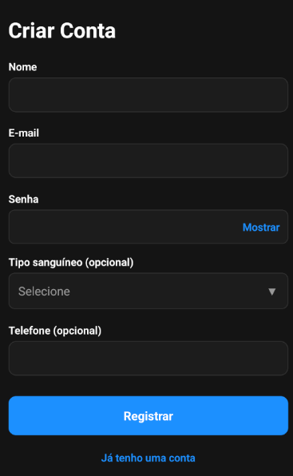
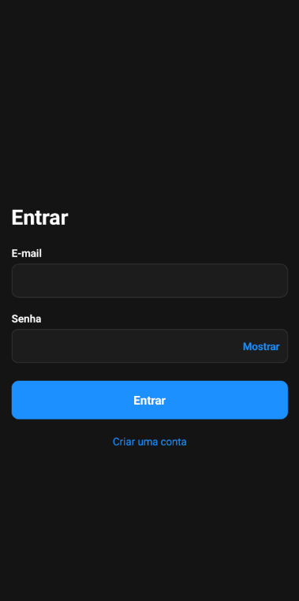
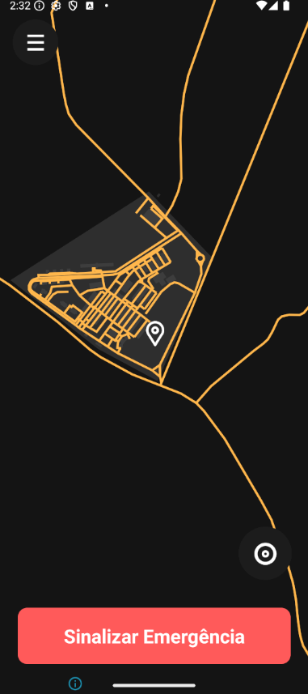
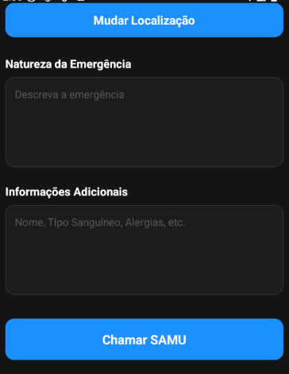
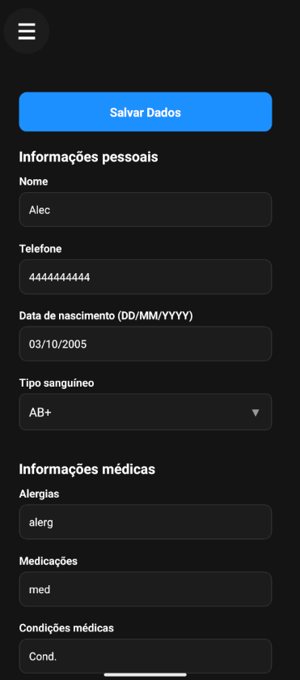
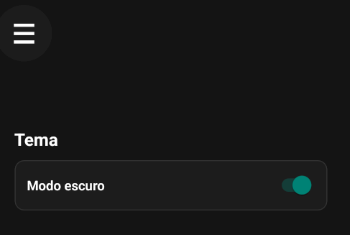
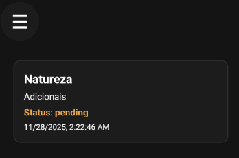

# Aplicativo SOS UTFPR 👋

Aplicativo para geração de emergência baseadas em coordenadas em um mapa.

## Fluxo principal do aplicativo

### Registro
Insira os dados necessários e pressione em Registrar

### Login

Simplesmente insira o email e senha e pressione em Entrar.

### Mapa
Pressione em um lugar para selecionar uma localização. Caso se perca, use o botão de reset no canto inferior direito.

### Tela de registro de emergência
Insira os dados e pressione em chamar SAMU. Uma emergência será registrada no nosso banco de dados.

### Tela de perfil
Usando o ícone no canto superior esquerdo você pode trocar para a tela de perfil. Nessa tela é possível atualziar suas informações pessoais e adicionar alguns que não foram preenchidas no cadastro.

### Tela de configurações
Permite que você alterne entre o modo claro e escuro.

### Tela de emergências
Lista todas as emergências que você registrou e as informações relevantes a elas.
